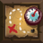
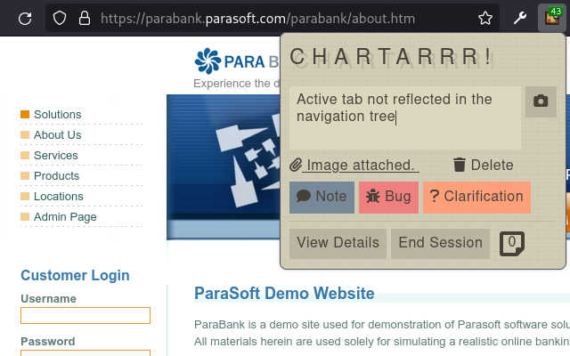
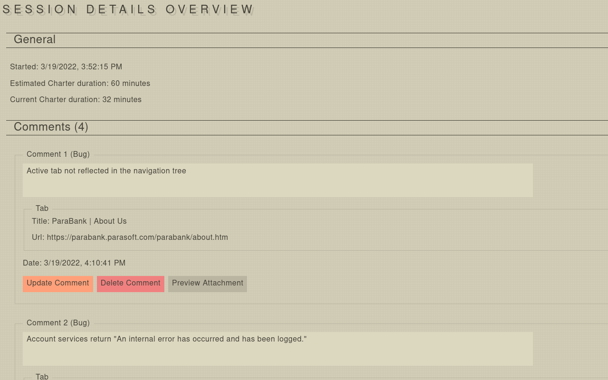
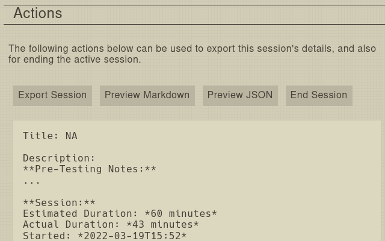

<h1 align="center">
	
		
	
	Chartarrr!
</h1>

Assisting in exploratory testing on the web via session based test charters.

	
	

## Description
Chartarrr!, a play on name between charters, and pirates is a web extension that assists you in note taking during your exploratory test sessions on the web.

As a [fully offline offering](https://github.com/umimaso/Chartarrr/blob/main/PRIVACY.md), Chartarrr! doesn't tie you into any proprietary service or store your data outside your browser. Providing peace of mind that all your testing notes, and screenshots are safe.

Features:
- Add comments by type, supporting notes, bugs, and clarifications
- Attach screenshots of your active tab against your note taking
- Keep track of your estimated session time with a handy badge timer
- View your current logged notes at any time during the session
- Once finished export it to Markdown, and JSON with all the images taken. Easing the process of logging the session to a external project management tool.
- Provide optional additional information about your charter during the end session flow. This will further populate the export with more useful details of your completed session.

## Installation
### Firefox
[Install from Moazilla Add-ons](https://addons.mozilla.org/en-US/firefox/addon/chartarrr/)

### Chromium (Chrome/Edge/Opera/Brave)
[Install from Chrome Web Store](https://chrome.google.com/webstore/detail/chartarrr/apiicneccfgpgnmpbnlggodkjmhocndj)

If you can't install from the Chrome Web Store for your Chromium browser of choice, you can manually install the extension with the packaged zip under releases. Installing the extension this way will not provide you with future updates automatically as if you'd installed it from the CWS.
- Download the released [chartarrr-x.x.x-chromium.zip](https://github.com/umimaso/Chartarrr/releases/)
- Unzip the download
- Go to your browsers Extensions page
- Toggle Developer mode on
- Select Load unpacked and select the unzipped release folder

## Screenshots

  
  
  

## Third Party Library Usage
Thanks to the maintainers, and contributors of the following libraries:
- [Font-Awesome 6.0.0](https://github.com/FortAwesome/Font-Awesome/tree/6.0.0)
- [normalize.css 8.0.1](https://github.com/necolas/normalize.css/tree/8.0.1)
- [yorha](https://github.com/metakirby5/yorha)
- [webextension-polyfill 0.8.0](https://unpkg.com/browse/webextension-polyfill@0.8.0/)
- [FileSaver.js v2.0.4](https://github.com/eligrey/FileSaver.js/tree/v2.0.4)
- [jszip v3.7.1](https://github.com/Stuk/jszip/tree/v3.7.1)

## License
[GPLv3](https://github.com/umimaso/Chartarrr/blob/main/LICENSE.txt)
